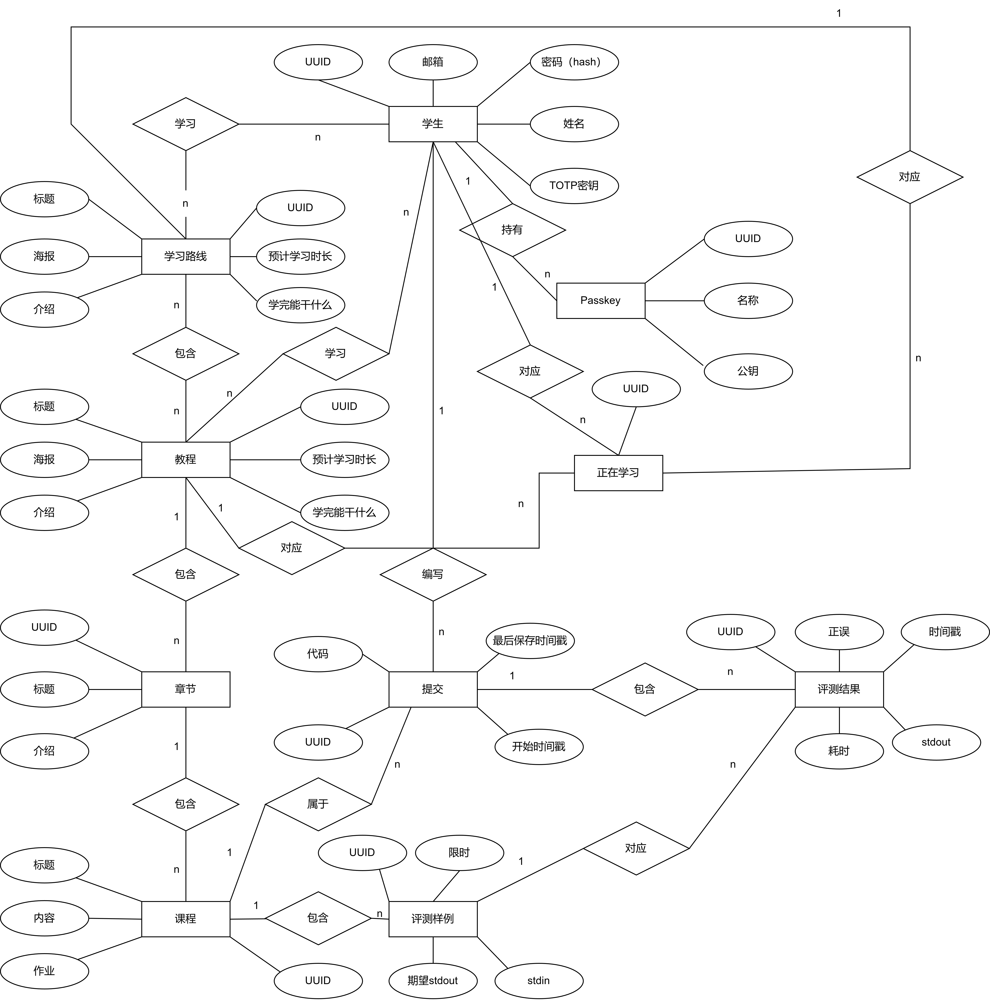

# 数据库设计文档

## E-R图

## 学生表（student）

| 字段        | 解释             | 类型           | 约束       | 默认值 |
| ----------- | ---------------- | -------------- | ---------- | ------ |
| id          | UUID             | varchar(63)    | 主键       |        |
| password    | 密码的Hash       | varchar(2047)  | 非空       |        |
| name        | 昵称             | varchar(63)    | 非空       |        |
| email       | 邮箱             | varchar(2047)  | 非空，唯一 |        |
| totp_secret | TOTP密钥（加密） | varbinary(255) | 无         |        |

## 正在学习（learning）

| 字段        | 解释                         | 类型        | 约束 | 默认值 |
| ----------- | ---------------------------- | ----------- | ---- | ------ |
| id          | UUID                         | varchar(63) | 主键 |        |
| student_id  | 学生UUID                     | varchar(63) | 非空 |        |
| tutorial_id | 教程/学习路线UUID            | varchar(63) | 非空 |        |
| type        | 类型（1是教程，2是学习路线） | int         | 非空 |        |

## 学习路线表（learning_path）

| 字段        | 解释                     | 类型        | 约束 | 默认值       |
| ----------- | ------------------------ | ----------- | ---- | ------------ |
| id          | UUID                     | varchar(63) | 主键 |              |
| title       | 标题                     | varchar(63) | 非空 | "新学习路线" |
| poster_link | 海报的链接               | text        | 非空 |              |
| description | 介绍                     | text        | 非空 | ""           |
| time        | 预计学习时长，单位：小时 | int         | 非空 | 0            |
| result      | 学完能干什么             | text        | 非空 | ""           |

## 教程表

| 字段             | 解释                       | 类型        | 约束 | 默认值   |
| ---------------- | -------------------------- | ----------- | ---- | -------- |
| id               | UUID                       | varchar(63) | 主键 |          |
| title            | 标题                       | varchar(63) | 非空 | "新教程" |
| learning_path_id | 对应的学习路线ID，分号隔开 | text        | 无   |          |
| poster_link      | 海报的链接                 | text        | 非空 |          |
| description      | 介绍                       | text        | 非空 | ""       |
| time             | 预计学习时长，单位：小时   | int         | 非空 | 0        |
| result           | 学完能干什么               | text        | 非空 | ""       |

## 章节表

| 字段        | 解释   | 类型        | 约束 | 默认值   |
| ----------- | ------ | ----------- | ---- | -------- |
| id          | UUID   | varchar(63) | 主键 |          |
| title       | 标题   | varchar(63) | 非空 | "新章节" |
| tutorial_id | 教程id | varchar(63) | 无   |          |
| description | 描述   | text        | 非空 | ""       |

## 课程表

| 字段       | 解释   | 类型        | 约束 | 默认值   |
| ---------- | ------ | ----------- | ---- | -------- |
| id         | UUID   | varchar(63) | 主键 |          |
| title      | 标题   | varchar(63) | 非空 | "新课程" |
| chapter_id | 章节ID | varchar(63) | 无   |          |
| content    | 内容   | text        | 非空 | ""       |
| homework   | 作业   | text        | 非空 | "无"     |

## 评测样例表

| 字段            | 解释           | 类型        | 约束 | 默认值 |
| --------------- | -------------- | ----------- | ---- | ------ |
| id              | UUID           | varchar(63) | 主键 |        |
| class_id        | 课程id         | varchar(63) | 无   |        |
| stdin           | stdin          | text        | 非空 | ""     |
| stdout_expected | 期望stdout     | text        | 非空 | ""     |
| time_limit      | 时间限制，毫秒 | bigint      | 非空 | 1000   |

## 评测结果表

| 字段      | 解释           | 类型        | 约束 | 默认值 |
| --------- | -------------- | ----------- | ---- | ------ |
| id        | UUID           | varchar(63) | 主键 |        |
| sample_id | 样例id         | varchar(63) | 无   |        |
| stdout    | stdout         | text        | 非空 | ""     |
| timestamp | 时间戳，毫秒级 | bigint      | 非空 |        |
| time_used | 耗时，毫秒     | bigint      | 非空 |        |
| submit_id | 提交ID         | varchar(63) | 非空 |        |

## Passkey表

| 字段       | 解释     | 类型        | 约束 | 默认值       |
| ---------- | -------- | ----------- | ---- | ------------ |
| id         | UUID     | varchar(63) | 主键 |              |
| name       | 名称     | varchar(63) | 非空 | "新通行密钥" |
| public_key | 内容     | text        | 非空 |              |
| owner_id   | 所有者ID | varchar(63) | 无   |              |

## 提交表

| 字段       | 解释           | 类型        | 约束 | 默认值 |
| ---------- | -------------- | ----------- | ---- | ------ |
| id         | UUID           | varchar(63) | 主键 |        |
| class_id   | 课程ID         | varchar(63) | 无   |        |
| owner_id   | 所有者ID       | varchar(63) | 无   |        |
| start_time | 开始时间戳     | bigint      | 非空 | 0      |
| last_save  | 最后保存时间戳 | bigint      | 非空 | 0      |

## 正在学习表

| 字段                        | 解释                       | 类型        | 约束    | 默认值     |
| --------------------------- | -------------------------- | ----------- | ------- | ---------- |
| id                          | UUID                       | varchar(63) | 主键    |            |
| learning_path_or_chapter_id | 教程或学习路线ID           | varchar(63) | 无      |            |
| owner_id                    | 所有者ID                   | varchar(63) | 无      |            |
| start_time                  | 开始时间戳                 | bigint      | 非空    | 0          |
| type                        | "learningPath"或"tutorial" | varchar(20) | 非空    | "tutorial" |
| progress                    | 进度                       | int         | max:100 | 0          |
